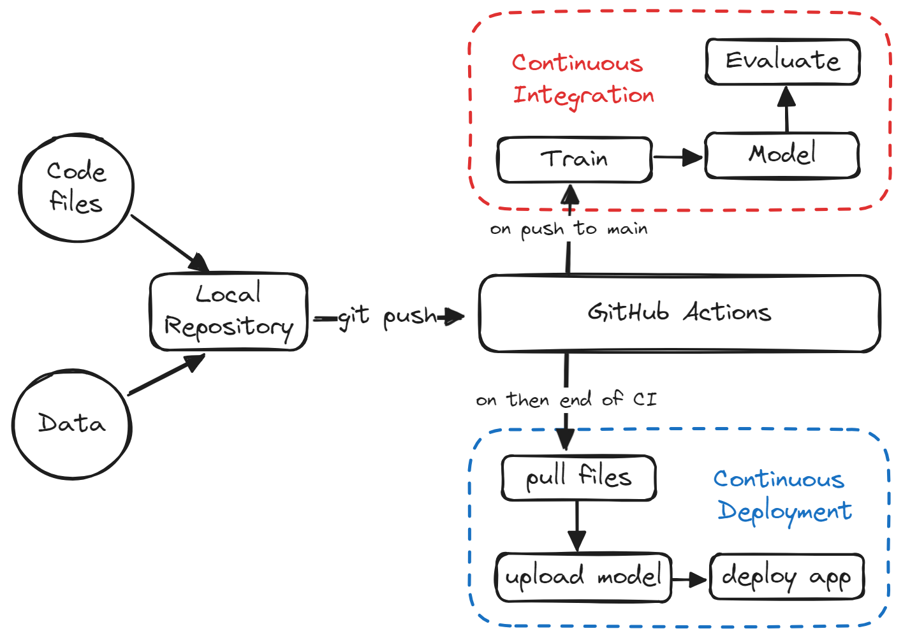
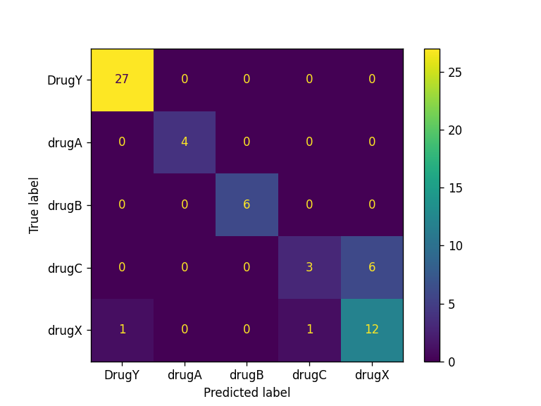

# CICD-for-Machine-Learning

Beginner's Guide to Automating Training, Evaluation, and Deploying Models using GitHub Actions.
## Pipeline

## Results
| Model                  | Accuracy | F1 Score |
|------------------------|----------|----------|
| RandomForestClassifier | 97.0%    | 94.0%    |

